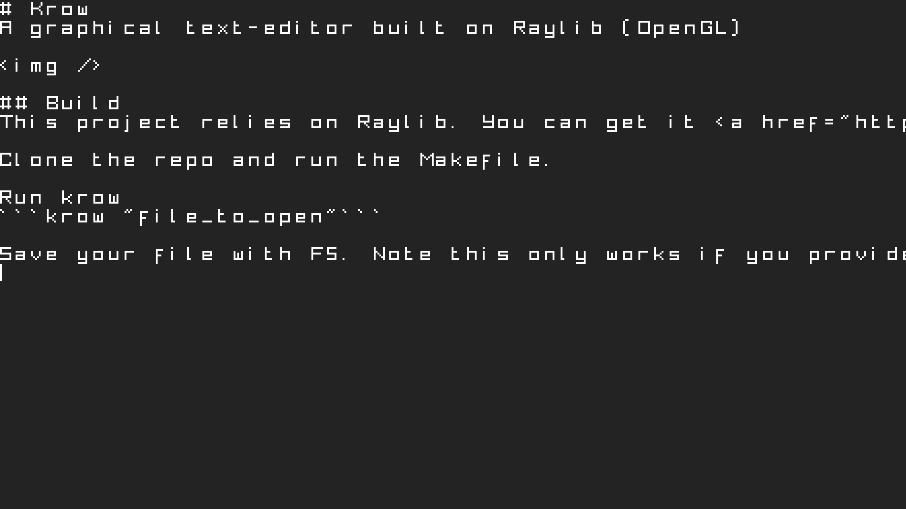

# Krow
A graphical text-editor built on Raylib. Only supports ASCII-based files.



## Build
This project relies on Raylib. You can get it <a href="https://github.com/raysan5/raylib">here</a>.

Clone the repo and run the Makefile.

Run krow
```krow <file_to_open>```

## Shortcuts
F11 - Fullscreen
F5 - Save File 
```Note this only works if you provided a file path argument when starting Krow.```
